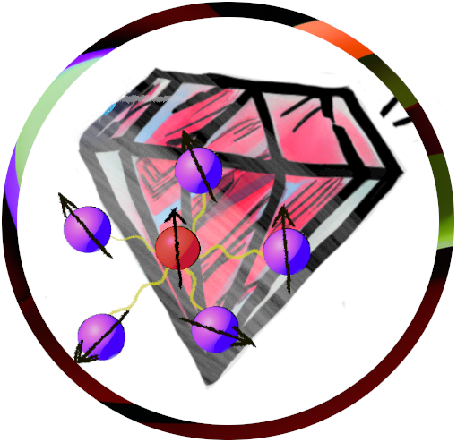
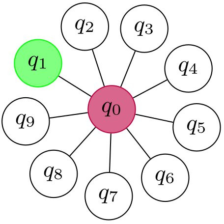

<div align="center">
 
</div>

# Nitrogen-vacancy center qubits

There is currently one virtual NV-center device, namely NV-center diamond that is inspired from devices in the University of Delft. This device is instantiated with command ``NVCenterDelft[]``.

**Table of contents**
1. [Characteristics](#characteristics)
2. [Native operations](#native-operations)
3. [Parameters and usage](#parameters-and-usage)

## Characteristics

NV-center has star-shaped connectivity, where the NV<sup>-</sup>  electron spin is sitting in the center, surrounded by the nuclear spins <sup>13</sup>C &mdash; and may also involve <sup>14</sup>Nq spin.
We set the electron spin to be indexed 0 in the program. See the picture below, where q0 is the electron spin and the rest are nuclear spin. The green circle represents nitrogen spin if you want to use it; this is decided in the setting up the parameters, e.g.,  particular fidelities and coherence time.


<div align="center">
 
</div>

Therefore, two-qubit gates operations can be done (directly) between the center spin to the surrounding spin.


## Native operations

Here are the operators defined in the virtual NV-center qubits, together with their commands.

- Direct initialisation is the NV electron spin only, can be performed anytime.
$$\mathtt{Init_0}$$
- Direct measurement is the NV electron spin only, can be performed anytime, and is projective measurement in the computational basis.
$$\mathtt{M_0}$$
- Single qubit gates are Pauli rotations that can be operated upon any qubit $q$.
$$\mathtt{Rx_q[\theta]}, \mathtt{Ry_q[\theta]}, \mathtt{Rz_q[\theta]}$$
- Two-qubit gates are conditional rotation between electron and nuclear spin $q>0$
$$\mathtt{CRx_{0,q}[\theta]}, \mathtt{CRy_{0,q}[\theta]}$$
where  $$\mathtt{CR\sigma[\theta]}=\|0\rangle\langle0\|\otimes R\sigma(\theta)+\|1\rangle\langle1\|\otimes R\sigma(-\theta)$$
- Doing nothing; remember it will introduce passive noise
$$\mathtt{Wait_q[\Delta t]}$$

## Parameters and usage

The following configuration takes inspiration from devices at the University of Delft: a virtual NV-center contains six qubits without considering the nitrogen spin. 

- Time unit is **second (s)**
- Frequency unit is **Hertz (Hz)**
- 0 is the index of NV<sup>-</sup> electron spin

The code below can be directly copied and executed. 
```Mathematica
Options[NVCenterDelft] = {
   QubitNum -> 6
   ,
   (* T1 of each qubit *)
   T1 -> <|0 -> 3600, 1 -> 60, 2 -> 60, 3 -> 60, 4 -> 60, 5 -> 60 |>
   ,
   (* T2 of each qubit; we assume dynamical decoupling is actively applied *)
   T2 -> <|0 -> 1.5, 1 -> 10, 2 -> 10, 3 -> 10, 4 -> 9, 5 -> 9|>
   ,
   (* dipolar interaction among nuclear spins: cross-talk ZZ-coupling in order of a few Hz on passive noise *)
   FreqWeakZZ -> 5
   ,
   (* direct single rotation on Nuclear spin is done via RF, put electron in state -1 leave out the Rx Ry on nuclear spins ideally. *)
   FreqSingleXY -> <|0 -> 15*10^6, 1 -> 500 , 2 -> 500, 3 -> 500,  4 -> 500, 5 -> 500|>
   ,
   (* usually done virtually *)
   FreqSingleZ -> <|0 -> 32*10^6, 1 -> 400*10^3, 2 -> 400*10^3, 3 -> 400*10^3, 4 -> 400*10^3, 5 -> 400*10^3|>
   ,
   (* Frequency of CRot gate, conditional rotation done via dynamical decoupling or dd+RF. The gate is conditioned on electron spin state *)
   FreqCRot -> <|1 -> 1.5*10^3, 2 -> 2.8*10^3, 3 -> 0.8*10^3, 4 -> 2*10^3 , 5 -> 2*10^3|>
   ,
   (* Fidelity of CRot gate  *)
   FidCRot -> <|1 -> 0.98, 2 -> 0.98, 3 -> 0.98, 4 -> 0.98 , 5 -> 0.98|>
   ,
   (* fidelity of x- and y- rotations on each qubit *)
   FidSingleXY -> <| 0 -> 0.9995, 1 -> 0.995, 2 -> 0.995, 3 -> 0.99, 4 -> 0.99, 5 -> 0.99 |>
   ,
   (* fidelity of z- rotations on each qubit *)
   FidSingleZ ->  <| 0 -> 0.9999, 1 -> 0.9999, 2 -> 0.99999, 3 -> 0.9999, 4 -> 0.999, 6 -> 0.99 |>
   ,
   (* Error ratio of 1-qubit depolarising:dephasing of x- and y-rotations  *)
   EFSingleXY -> {0.75, 0.25}
   ,
   (* Error ratio of 2-qubit depolarising:dephasing of CRot gate *)
   EFCRot -> {0.9, 0.1}
   ,
   (* initialization fidelity on the electron spin *)
   FidInit -> 0.999
   ,
   (* initialization duration on the electron spin *)
   DurInit -> 2*10^-3
   ,
   (* measurement fidelity on the electron spin *)
   FidMeas -> 0.946
   ,
   (* measurement duration on the electron spin *)
   DurMeas -> 2*10^-5
   };
```

In practice, dynamical decoupling is constantly applied to passive qubits to mitigate unwanted interaction. For instance, let ``circuit`` be a circuit comprises native operations. The following command obtain noisy version of running ``circuit`` on the virtual NV-center defined above.

```Mathematica
noisycircscheduled = InsertCircuitNoise[List /@ circuit, NVCenterDelft[], ReplaceAliases -> True];
noisycirc = Extractcircuit @ noisycircscheduled;
ApplyCircuit[rho, noisycirc]
```
Variable ``noisycircscheduled`` contains noise-decorated ``circuit`` together with its schedule.
Command ``List /@ circuit`` imposes serial implementation, 
turning every element into a set, i.e., maps a set {a,b,c,...} to {{a},{b},{c}...}. 
Therefore, passive noise becomes more prevalent; however, given that dynamical decoupling is assumed, the coherence values (T1 and T2) supposed to be high with this implementation. Note that, option ``ReplaceAliases`` replaces gate aliases/custom gates into standard **QuESTlink** operations. For instance ``Init`` gate, which is intialisation is defined as amplitude damping operation.  
Variable ``noisycirc`` contains noise-decorated ``circuit`` that is ready for simulation. 
Command ``ExtractCircuit[]`` basically removes the schedule information.
