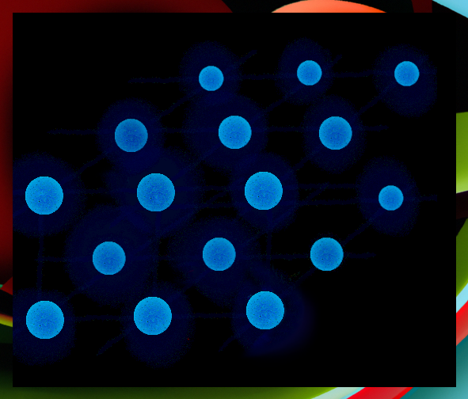
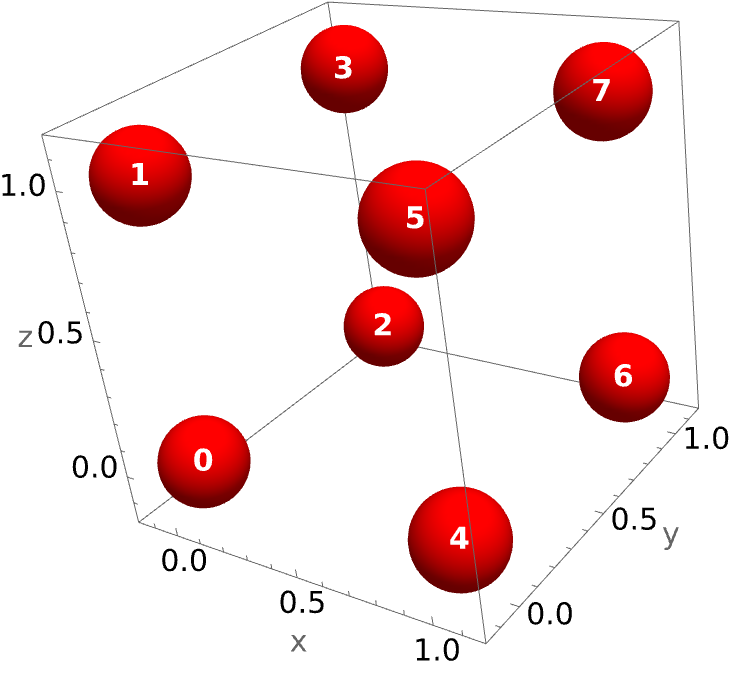
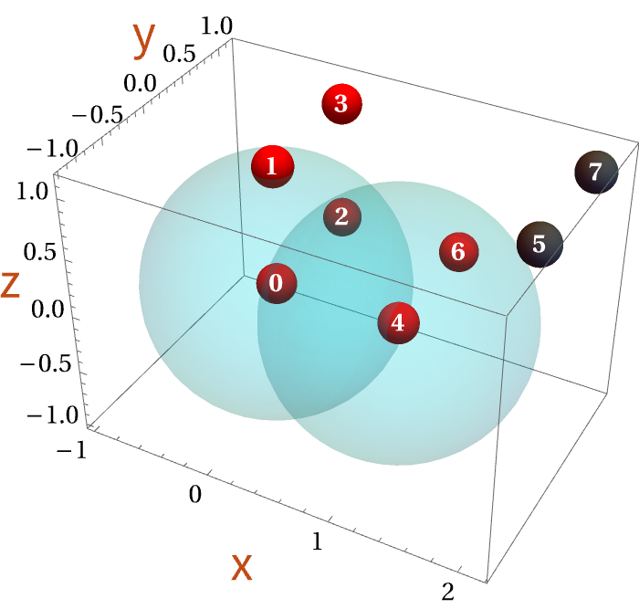

<div align="center">
 
</div>

# Neutral atoms

There is currently one virtual neutral atom device, namely Rydberg atom device that is inspired by devices in the University of Strathclyde and the University of Harvard. This device is instantiated with the command ``RydbergHub[]``.

**Table of contents**
1. [Characteristics](#characteristics)
2. [Native operations](#native-operations)
3. [Parameters and usage](#parameters-and-usage)

## Characteristics


Rydberg atoms/qubits are arranged inside a vacuum chamber. The atoms' configuration can be arbitrary for 2D and 3D geometries. Every atom is identical; they have the same noise characteristics and blockade radius.  Qubits connectivity is fully connected, as multi-qubit gates operations can be done to any set of atoms as long as they lie within their overlapping radii. The user needs to reconfigure the atoms in order to fulfil the requirement; this is achieved by swapping and shifting the locations of the atoms.

Since atoms configuration is important, we provide a visualisation function ``PlotAtoms[]`` that will show the register/atoms configuration. 

The following example generates a Rydberg device ``dev`` and plots its configuration. 

```Mathematica
dev = RydbergHub[]
PlotAtoms[dev]
```
 

``PlotAtoms`` has options &mdash; with their default values &mdash; ``ShowBlockade->{}`` and ``ShowLossAtoms->False``; the first option shows the blockade radii of a set of atoms (empty by default) and the second option will show the last location of atoms that are lost to the environment (False by default). In addition, you can input the options from graphics as well to modify the visualisation style. 

For instance, the following commands perform a circuit composing shifting location of atoms 5 and 7, followed by measurement on them.  For instance, in this device, the atoms are lost to the environment with a high chance after measurement. Then, we plot the configuration of the register afterwards.
```Mathematica
circuit = {Subscript[ShiftLoc, 5, 7][{1, 0, 0}], Subscript[M,5], Subscript[M,7]}
InsertCircuitNoise[circuit, dev];
PlotAtoms[dev, ShowBlockade->{0,4}, ShowLossAtoms->True, LabelStyle->"Section", BaseStyle->Directive[14, FontFamily->"Times"]]
```
 

In the ``PlotAtoms[]`` command, option ``ShowBlockade->{0,4}`` shows blockade radii of atoms 0 and 4 which are overlapping, option ``ShowLossAtoms->True`` displays the last locations of atoms 5 and 7 before lost to the environment, indicated with grey colours, and the rest of options change style of the plots, i.e., font styles.


## Native operations

Below are the operators defined in the virtual Rydberg atom qubits, together with their commands.

- Initialisation can be done on any atom $q$, at anytime
$$\mathtt{Init_q}$$
- Measurement in the computation basis can be done anytime on any atom $q$; this process induces the atom lost to the environment.
$$\mathtt{M_q}$$
- Single-qubit gates comprise Pauli rotations, (frequently used) Hadamard, and arbitrary drive (single rotation ``SRot``)
$$\mathtt{Rx_q[\theta], Ry_q[\theta],Rz_q[\theta],H_q,SRot_q[\Phi, \Delta, dt]}$$,
where given that  $\tilde\Omega=\sqrt{\Omega^2+\Delta^2}$, and $\Omega$ indicates the Rabi frequency,

$$\mathtt{SRot[\Phi,\Delta,dt]}=\begin{pmatrix}\cos(\frac{\tilde\Omega t}{2})-i \frac{\Delta}{\tilde\Omega}\sin(\frac{\tilde\Omega t}{2})&-i\frac{\Omega}{\tilde\Omega}\sin(\frac{\tilde\Omega t}{2})e^{i\phi}  \\\\ -i\frac{\Omega}{\tilde\Omega}\sin(\frac{\tilde\Omega t}{2})e^{-i\phi} &\cos(\frac{\tilde\Omega t}{2}) +i\frac{\Delta}{\tilde\Omega}\sin(\frac{\tilde\Omega t}{2})\end{pmatrix}$$

- Two-qubit controlled-Z, given that atoms $\mathtt{q1}$ and $\mathtt{q2}$ lie within their overlapping radii.
$$\mathtt{CZ_{q1,q2}}$$
- Multi-qubit gates on atoms multiple-controlled Z, given that atoms $\mathtt{q1,q2,q3,...,qt}$ lie within their overlapping radii.
$$\mathtt{C_{q1,q2,q3,...}}[Z_{qt}]$$ 
- Multi-qubit gates on atoms one-control multiple-Z, given that atoms $\mathtt{q1,q2,q3,...,qc}$ lie within their overlapping radii.
$$\mathtt{C_{qc}}[Z_{q1,q2,q3,...}]$$ 
- Register reconfiguration: swap the location of atoms $\mathtt{q1}$ and $\mathtt{q2}$
$$\mathtt{SWAPLoc_{q1,q2}}$$
- Register reconfiguration: shift location of atoms $\mathtt{q1,q2,q3,...}$ by a vector $v$
$$\mathtt{ShiftLoc_{q1,q2,q3,...}}[v]$$
- Doing nothing; remember it will introduce passive noise
$$\mathtt{Wait_q[\Delta t]}$$

## Parameters and usage

The following configuration takes inspiration from a device at Harvard University: seven-qubit Rydberg atom device based on this [reference](https://doi.org/10.1038/s41586-022-04592-6), in the Steane code stabiliser measurement experiment.

- Time unit is **microseconds** ($\mu s$)
- Frequency unit is **megahertz (MHz)**
- Length/distance unit is **micrometer** ($\mu m$) 

The code below can be directly copied and executed. 

```Mathematica
Options[RydbergHub] = {
   (* The total number of atoms/qubit*)
   QubitNum -> 7
   ,
   (*Physical location on each qubit described with a 2D- or 3D-vector*)
   AtomLocations -> <|6 -> {0, 1}, 5-> {1, 1}, 2 -> {2, 1}, 1 -> {4, 1}, 4 -> {2, 0}, 0 -> {4, 0}, 3 -> {5, 0}|>
   ,
   (* It's presumed that T2* has been echoed out to T2 *)
   T2 -> 1.5*10^6
   ,
   (* The lifetime of vacuum chamber, where it affects the T1 time, T1=Tvac/N, where N=number of atoms  *)
   VacLifeTime -> 48*10^6
   ,
   (* Rabi frequency of the atoms. We assume the duration of multi-qubit gates is as long as 4$\pi$ pulse of single-qubit gates *)
   RabiFreq -> 1
   ,
   (* Asymmetric bit-flip error probability; the error is acquired during single qubit operation *)
   ProbBFRot -> <|10 -> 0.001, 01 -> 0.03|>
   ,
   (* This will be the unit of the lattice and coordinates *)
   UnitLattice -> 3
   ,
   (* blockade radius of each atom *)
   BlockadeRadius -> 1
   ,
   (* Leakage probability during initialisation process *)
   ProbLeakInit -> 0.001
   ,
   (* Leakage probability during initialisation process *)
   DurInit -> 5*10^5
   ,
   (* Duration of moving atoms; we assume SWAPLoc and ShiftLoc take this amount of time *)
   DurMove -> 100
   ,
   (* The factor that estimates accelerated dephasing due to moving the atoms. Ideally, it is calculated from the distance and speed. *)
   HeatFactor -> 10
   ,
   (* Fidelity of qubit readout *)
   FidMeas -> 0.975
   ,
   (* Duration of readout *)
   DurMeas -> 10
   ,
   (* The increasing probability of atom loss on each measurement. The value keeps increasing until being initialised *)
   ProbLossMeas -> 0.0001
   ,
   (* leak probability of implementing multi-qubit gates *)
   ProbLeakCZ -> <|01 -> 0.01, 11 -> 0.0001|>
   }; 
```
To allow efficient gates implementation that also reflects to what happen in practice, we provide gates arrangement command
``CircRydbergHub[]`` with option to implement parallel (``CircRydbergHub[circuit, device, Parallel -> True]``) or serial implementation.
(``CircRydbergHub[circuit, device, Parallel -> False]``). 

Parallelisation in neutral atoms is atomic configuration-dependent, where concurrent operations can be performed if
the corresponding atoms operated upon do not have their blockade radii overlapped.
This means, if two atoms have their blockade radii overlapping, then parallel gates cannot be performed upon them. 
On the other hand, serial implementation imposing gates to be performed one at a time, but initialisations are done simultaneously.
This reflects the initialisation process in practice comprises loading and rearranging the atoms. 

Here is an example of implementing a ``circuit`` in parallel fashion, on a virtual netural atoms. Note that ``circuit`` contains legitimate operations
taking into account requirement on the atomic configurations, e.g., two-qubit gates are legit to atoms within their overlapping blockade radii.

```Mathematica
mydev = RydbergHub[];
noisycircscheduled = InsertCircuitNoise[CircRydbergHub[circuit, mydev, Parallel -> True], mydev, ReplaceAliases -> True];
noisycirc = ExtractCircuit @ noisycircscheduled;
ApplyCircuit[rho, noisycirc];
```
First, ``mydev`` contains an instance of ``RydbergHub[]``.
Second, ``noisycircscheduled`` contains noise-decorated of parallel implementation of ``circuit``. 
Note that, ``InsertCircuitNoise`` command modifies ``mydev``; for instance, the arrangement of atoms, loss probabilities
due to measurements are updated and stored in ``mydev``.
Parallel arrangement is taken care by command ``CircRydberghub[Parallel -> True]``,
which takes into account register reconfiguration operations in ``circuit``.
Third, ``noisycirc`` contains the noise-decorated ``circuit`` without schedule information. 
Finally, ``ApplyCircuit`` command operates the noisy circuit ``noisycirc`` to a density of states ``rho``.