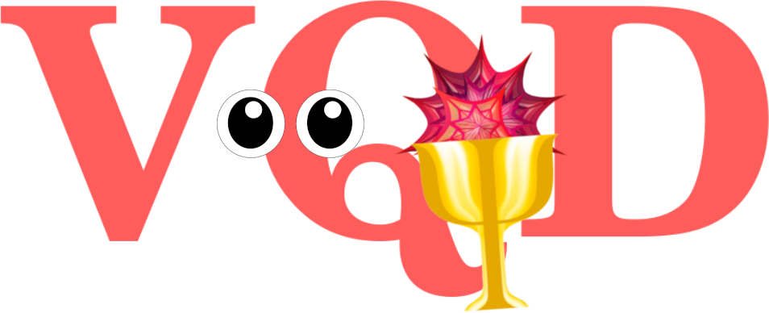

<div align="center">
 
</div>

# Virtual Quantum Devices

**VQD** is a **Mathematica** package that contains a collection of virtual quantum devices that are based on or inspired by actual quantum devices. **VQD** is built atop [**QuESTlink**](https://github.com/QTechTheory/QuESTlink), a Mathematica extension of [**QuEST**](https://github.com/QuEST-Kit/QuEST): a powerful open-source emulator of quantum computers developed in **C**.  
 **QuESTlink** combines **Mathematica**’s powerful symbolic operations with **QuEST**’s high-performance backend, enabling virtual devices to be highly configurable through an intuitive interface, and able to leverage powerful visualisation facilities, without compromising performance!


[](https://www.wolfram.com/mathematica/) [](https://www.wolfram.com/mathematica/)  [](LICENCE.txt) 
[](https://github.com/QTechTheory/QuESTlink) [](https://github.com/QuEST-Kit/QuEST)


This package is developed by [Cica Gustiani](https://github.com/cicacica) within the University of Oxford, in [Simon Benjamin](https://qtechtheory.org/) group.

[](mailto:cicagustiani@gmail.com)
[](https://arxiv.org/abs/2306.07342)


## Our goal

We aim to facilitate the creation of virtual quantum devices with ease. We have developed an environment in which users can readily input parameters commonly mentioned in experimental papers such as **T<sub>1</sub>, T<sub>2</sub>, T<sub>2</sub><sup>*</sup>, qubit frequency, coupling strength, blockade radius, leakage probability, gate fidelities, initialisation fidelities**, and so forth.

We've designed this to function as a user-friendly, plug-and-play platform. This empowers users to test their concepts and estimate their performance on actual devices, even across different noise scales. Not only useful for testing, this platform can also assist experimentalists in making estimates of certain parameters. All of these factors contribute to making quantum exploration more accessible.


## Five families of virtual quantum devices

Currently, we provide five types of quantum devices. Navigate to the corresponding folder in which a short guide is provided for each device.

Our current devices includes:
1. Ion traps
2. Nitrogen-vacancy-center  (NV-center) 
3. Neutral atoms
4. Semiconductor spin qubits
5. Superconducting qubits.


Each type of quantum device is unique and is based on or inspired by actual devices. For more in-depth information on the architecture and used error models, refer to our [**paper**](https://arxiv.org/abs/2306.07342). 

## Quickstart


Our virtual device is designed to reflect a close approximation to the physical reality. It achieves this by offering access solely to native operations and parameters that are physically feasible and tailored specifically to the quantum device in question. Therefore, users will find it beneficial to have some understanding of the devices they're interested in. But don't worry if you're not there yet &mdash; you can get up to speed quickly by diving into our [**paper**](https://arxiv.org/abs/2306.07342), or follow the steps below.


### **1. Navigate to the Desired Folder**

We categorise devices into five separate folders, that correspond to the family of quantum devices. Select the folder of your interest:
- `TrappedIon` - For ion trap devices
- `NVCenter` - For NV-center devices
- `NeutralAtom` - For neutral atom devices
- `SemiconductorSpin` - For semiconductor spin qubits in quantum dots devices
- `SuperconductingQubit` - For superconducting qubit devices

### **2. Review the Quick Documentation**

After you've selected and entered the appropriate folder, take a moment to read the quick documentation provided. This brief overview will introduce you to the function that generates the corresponding virtual device.

### **3. Run the Example Notebooks**

Inside every folder, you'll find an example notebook. These notebooks serve to demonstrate the functionality of each respective device. We recommend running these notebooks to get a hands-on understanding of how the devices operate.

### **4. Compare the Results**

Once you've run the notebooks, you should have generated outcomes. To verify the accuracy of your results, compare your outcomes with those depicted in the corresponding PDF file, which is included in each folder.

By following these steps, you'll get a feeling of how various quantum devices operate, as each device type has unique capabilities and requirements.


## General usage

The **VQD** functionalities are neatly packaged within the `vqd.wl` file, where you can instantiate virtual quantum devices. As it is built atop **QuESTlink**, one must first load the **QuESTlink** package. 

Here's how you can do this in Mathematica:

```Mathematica
Import["https://qtechtheory.org/questlink.m"]
CreateDownloadedQuESTEnv[];
```

The above commands perform two tasks. The first imports the **QuESTlink** package and the second downloads a *link binary* named `quest_link`. This link binary contains the protocols for linking the **QuEST** code to your Mathematica environment.

If you wish to leverage parallelisation features such as multi-threading or GPU processing, you'll need to perform a manual compilation on the link binary.  You can find step-by-step instructions in the [QuESTlink documentation](https://github.com/QTechTheory/QuESTlink/tree/main/Doc). 

Finally, load the **VQD** package,

```Mathematica
Get["vqd.wl"]
```
and access the API of **VQD**
```Mathematica
?VQD`*
```


### Virtual device instantiation and customisation

A virtual device in our system holds descriptions of various physical quantum devices, encapsulating the characteristic of devices like architecture, legitimate operations, and every error that comes with every operation. Our noise descriptions generally have complete-positive map forms.

To create these device descriptions, we provide functions that align with specific quantum device types

- ``TrappedIonOxford[]`` for the multi-node ion traps based on the University of Oxford devices.
- ``NVCenterDelft[]`` for the NV-center diamonds based on the University of Delft devices.
- ``RydbergHub[]`` for the Rydberg neutral atoms based on the University of Strathclyde devices.
- ``SiliconDelft[]`` for the Si/SiGe spin qubits based on the University of Delft devices.
- ``SuperconductingHub[]`` for the superconducting transmon qubits based on the University of Oxford devices.


These functions do not come with default parameters. Users must set these parameters, reflecting the fundamental characteristics of their devices. Here is an example of how to set parameters for the `TrappedIonOxford` function:

```Mathematica
Options[TrappedIonOxford] = 
{
QubitNum -> 6
,
T1 -> <|0 -> 3600, 1 -> 60, 2 -> 60, 3 -> 60, 4 -> 60, 5 -> 60 |>
,
T2 -> <|0 -> 1.5, 1 -> 10, 2 -> 10, 3 -> 10, 4 -> 9, 5 -> 9|>
,
FreqWeakZZ -> 5
,
FreqSingleXY -> <|0 -> 15*10^6, 1 -> 500 , 2 -> 500, 3 -> 500, 4 -> 500, 5 -> 500|>

... (and so on)

}
```
In the corresponding folder, we offer a set of examples on how to configure these parameters, as well as the range of numbers that are typically based on actual, approximately realistic, devices. These examples provide a practical view of realistic parameters that you can easily modify according to your needs or your devices.

The following command instantiates a virtual ion trap with the default parameters set above.

```Mathematica
TrappedIonOxford[]
```
Overriding default parameters devices can be done on the fly; for example 
```Mathematica
TrappedIonOxford[FreqWeakZZ -> 10]
```
which overrides the default parameter ``FreqWeakZZ``.


## Build your own virtual device

Want to build a virtual device from scratch? follow the QuESTlink guide [here](https://github.com/QTechTheory/QuESTlink/blob/main/Doc/guide_creating_device_spec.pdf) to create your own device.


## Acknowledgements

The development of this package would not have been possible without the significant contributions and collaborations of many individuals.

- **Scientific Contributors:** 
Mohammed Alghadeer, Mohamed Abobeih, Simon Benjamin, Alessandro Ciani, Shuxiang Cao, Andrew Daley, Joseph Goodwin, Fernando Gonzalez-Zalba, Tomas Kozlej, Peter Leek, David Nadlinger, Natalie Pearson, Gerard Pelergi, Cody Poole, Jonathan Pritchard, Mark Saffman, Jason Smith, and Joanna Zajac, for designing error models and describing their quantum devices as well as the processes happening.

- **Software Contributors:** 
Tyson Jones, for providing essential support on the QuESTlink part.

✨THANK YOU✨

