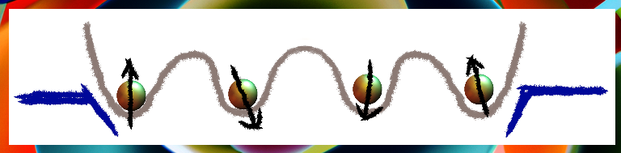
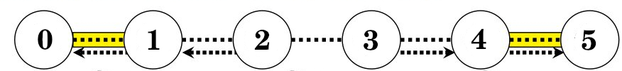

<div align="center">
 
</div>

# Semiconductor spin qubits

There is currently one virtual spin qubit in semiconductor quantum dots device, where quantum dots are defined in the <sup>28</sup>Si quantum well of the <sup>28</sup>Si/SiGe heterostructure. This device is based on a quantum device in the University of Delft and is instantiated with the command ``SiliconDelft[]``. 

**Table of contents**
1. [Characteristics](#characteristics)
2. [Native operations](#native-operations)
3. [Parameters and usage](#parameters-and-usage)


## Characteristics

The device has 1D linear architecture with nearest neighbour connectivity. There is favoured direction on the two-qubit gates implementation and direct measurement is only possible on the pair edge qubits, which is parity measurement.

For instance, the architecture below is based on a silicon device in Delft [here](https://doi.org/10.1038/s41586-022-05117-x), and consists of six qubits. 

<div align="center">
 
</div>

The arrows in the architecture denote the connectivity of CNOT gates, with each arrow directed towards the target qubits. The dashed lines, on the other hand, represent the symmetric connectivity of the controlled-phase gates. The regions marked in yellow perform the function of parity measurement, specifically, they measure the parity between qubits 0,1 and 4,5. This architecture can be straightforwardly extended to incorporate any even number of qubits. With such a mechanism, initialisations are constrained to start from the edge qubits.

The parity measurement operator distinguishes even ($\|01\rangle,\|10\rangle$) and odd outcomes ($\|00\rangle,\|11\rangle$) followed with fast decay of state $\|01\rangle$ into $\|10\rangle$. We describe such parity measurement with the following operations:
$$\mathcal{M}=\mathcal{K}(M)$$
where $M$ is the parity measurement projector and $\mathcal{K}$ is a CPTP map describing the state decay,
$$M=\\{ (\|01\rangle\langle01\|+\|10\rangle\langle10\|,\mathtt{0}),(\|00\rangle\langle00\|+\|11\rangle\langle11\|,\mathtt{1}) \\}$$
$$\mathcal{K}=\\{\|00\rangle\langle00\|,\|11\rangle\langle11\|,\|10\rangle\langle10\|,\|10\rangle\langle01\|\\}$$

## Native operations

Below are the operators defined in the virtual silicon spin qubits, together with their commands.

- Initialisation must be done from edge qubits at any time. For example, in the case of the six-qubit device shown above, here are the legitimate initialisation commands.
$$\mathtt{Init_{0,1}, Init_{0,1,2}, Init_{4,5}, Init_{3,4,5}}$$
- Parity measurement can be done only on the edge qubits. For example, in the case of the six-qubit device shown above, legitimate parity measurements are shown below.
$$\mathtt{MeasP_{0,1},MeasP_{4,5}}$$
- Single-qubit gates comprise Pauli rotations.
$$\mathtt{Rx_q[\theta], Ry_q[\theta],Rz_q[\theta]}$$
- The controlled-Z and controlled-phase gates can be operated upon nearest-neighbour qubits; here $\mathtt{p}$ and $\mathtt{q}$ are nearest neighbours
$$\mathtt{C_{p}[Z_q], C_{p}[Ph_q[\theta]]}$$
- The CNOT gates can be operated upon nearest-neighbour qubits with certain directions (see **Characteristics** section above).
$$\mathtt{C_p[X_q]}$$
- Doing nothing; remember it will introduce passive noise
$$\mathtt{Wait_q[\Delta t]}$$

## Parameters and usage

The following configuration takes inspiration from a device at the University of Delft: six-qubit silicon device based on this [reference](https://doi.org/10.1038/s41586-022-05117-x). Device architecture is pictured above (see **Characteristics**).


- Time unit is **microseconds** ($\mu s$)
- Frequency unit is **megahertz (MHz)**


The code below can be directly copied and executed. 
```Mathematica
Options[SiliconDelft] =
  {
  (* The number of qubits *)
   QubitNum -> 6
   ,
   (* T1 of every qubit *)
   T1 -> 10^4
   ,
   (* We assume T2* is echoed out to T2 *)
   T2 -> <|0 -> 14, 1 -> 21.1, 2 -> 40.1, 3 -> 37.2, 4 -> 44.7, 5 -> 26.7|>
   ,
   (* Qubit frequency of each qubit *)
   QubitFreq -> <|0 -> 15.62*10^3, 1 -> 15.88*10^3, 2 -> 16.3*10^3,  3 -> 16.1*10^3, 4 -> 15.9*10^3, 5 -> 15.69*10^3|>
   ,
   (* Rabi frequency of single rotations on each qubit *)
   RabiFreq -> <|0 -> 5, 1 -> 5, 2 -> 5, 3 -> 5, 4 -> 5, 5 -> 5|>
   ,
   (* Set the noise form of off-resonant Rabi oscillation. This takes RabiFreq information to produce the noise.*)
   OffResonantRabi -> True
   ,
   (* Set the standard depolarising and dephasing passive noise using T1 and T2 *)
   StdPassiveNoise -> True
   ,
   (* Fidelities of X- and Y- rotations by random benchmarking *)
   FidSingleXY -> <|0 -> 0.9977, 1 -> 0.9987, 2 -> 0.9996, 3 -> 0.9988, 4 -> 0.9991, 5 -> 0.9989|>
   ,
   (* Error fraction/ratio {depolarising, dephasing} sum is either one or zero (off) *)
   EFSingleXY -> {0, 1}
   ,
   (*  The rabi Frequency and fidelities of controlled-Z(C[Z]), nearest-neighbors. Keys are the smallest qubit number.  This applies to controlled-Ph gates *)
   FreqCZ -> <|0 -> 12.1, 1 -> 11.1, 2 -> 6.6, 3 -> 9.8, 4 -> 5.4|>
   ,
   (* Fidelity of controlled-Z, the numbers below indicate the lower number of qubits *)
   FidCZ -> <|0 -> 0.9374945614729504`, 1 -> 0.9339691831083574`, 2 -> 0.9286379436705322`, 3 -> 0.9967228426036524`, 4 -> 0.9793017377403548`|>
   ,
   (* Fidelity of CROT(CNOT) rotation *)
   FidCRot -> 0.9988
   ,
   (* Rabi frequency of CROT(CNOT), obtained by conditional microwave drive *)
   FreqCRot -> 5
   ,
   (* Error fraction/ratio {depolarising, dephasing} of controled- Ph(Pi) or controlled-Z. The error for other angles is scaled from Pi. *)
   EFCZ -> {0, 1}
   ,
   (* Crosstalks error (C-Rz[ex])on the passive qubits when applying CZ gates; square matrix with dims nqubit-2 *)
   ExchangeRotOn -> {{0, 0.023, 0.018 , 0.03, 0.04}, {0.05 , 0, 0.03, 0.03, 0.04}, {0.05, 0.03 , 0, 0.07, 0.042}, {0.038 , 0.03 , 0.031, 0 , 0.25}, {0.033, 0.03 , 0.02, 0.03, 0}}
   ,
   (* Crosstalks error (C-Rz[ex])on the passive qubits when no CZ gates applied; the qubits below indicate the controlled-qubit *)
   ExchangeRotOff -> <|0 -> 0.039, 1 -> 0.015 , 2 -> 0.03 , 3 -> 0.02, 4 -> 0.028|>
   ,
   (* Parity readout fidelity/charge readout fidelity between Q0,Q1 or Q4,Q5 *)
   FidRead -> 0.9997
   ,
   (*Parity readout duration  *)
   DurRead -> 10
   };
```

It is common to apply gates in serial manner in practice, which adds an asumption that
some dynamical decoupling sequences are constantly applied to passive qubits.
The following command obtain the noisy version of ``circuit`` running on a virtual silicon spin qubit, 
e.g., virtual device with configuration above.

```Mathematica
noisycircscheduled = InsertCircuitNoise[Serialize @ circuit, SiliconDelft[], ReplaceAliases -> True];
noisycirc = ExtractCircuit @ noisycircscheduled;
ApplyCircuit[rho, noisycirc];
```
First, variable ``noisycircscheduled`` contains noise-decorated circuit together with its schedule.
Command ``Serialize @ circuit`` imposes simple serial implementation,
turning every element into a set, i.e., maps a set {a,b,c,...} to {{a},{b},{c}...}.
Therefore, passive noise becomes more prevalent; however, given that dynamical decoupling
is assumed, the coherence values (T1 and T2) supposed to be high with this implementation.
Note that, option ``ReplaceAliases`` replaces gate aliases/custom gates into standard 
**QuESTlink** operations: for instance ``Init`` gate here will be replaced with a
series of operations involving parity measurements.
Variable ``noisycirc`` contains noise-decorated ``circuit`` that is ready for simulation.
Second, the command ``ExtractCircuit[]`` basically removes the schedule information.
Finally, command ``ApplyCircuit`` operates ``noisycirc`` upon the density matrix ``rho``.

