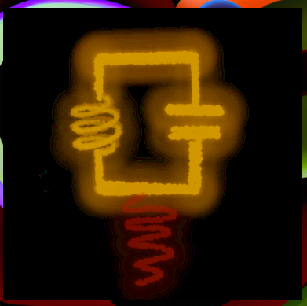
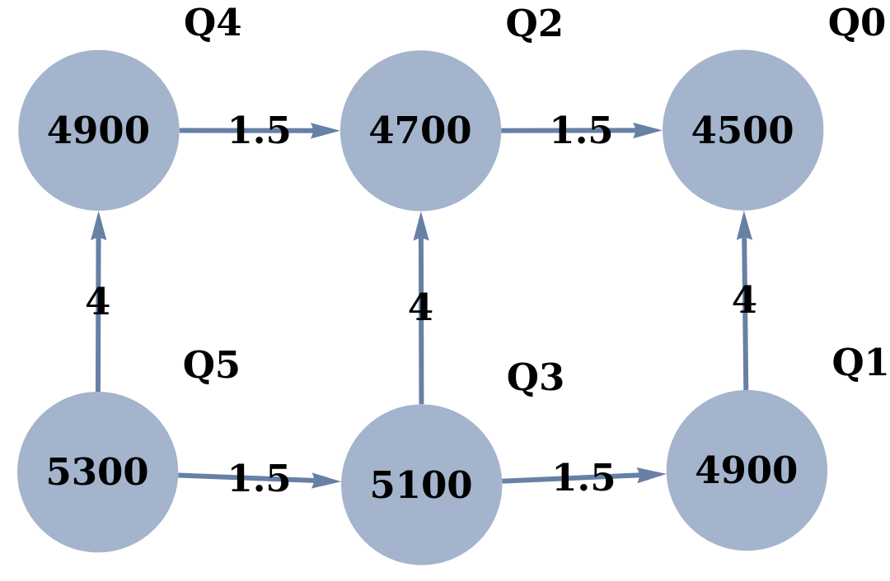

<div align="center">
 
</div>

# Superconducting qubits

There is currently one virtual superconducting qubit devices, which is superconducting transmon qubits connected with cpacitive coupling. This device is based on quantum device in the University of Oxford, which is instantiated by ``SupercondcutingHub[]``.

**Table of contents**
1. [Characteristics](#characteristics)
2. [Native operations](#native-operations)
3. [Parameters](#parameters)

## Characteristics

Architecture of the device is entirely determined by the user, in particular, by setting up qubit frequencies and coupling strengths. Based on these user-defined settings, the program will generate the corresponding connectivity.
 
The connectivity can be displayed by accessing key ``Connectivity``. For instance, the following command instantiates VQD and shows the connectivity.
 
```Mathematica
dev = SuperconductingHub[];
dev[Connectivity]
```
The command above outputs the layout of the device architecture below  
<div align="center">
 
</div>
where nodes correspond to transmon qubits and edges indicate capacitive coupling between the qubits. The numbers displayed on the nodes represent the frequencies of the qubits, whereas those on the edges correspond to the coupling strength. All frequency values are expressed in MHz, and the edges are directed towards the higher qubit frequencies, which dictate the preferred direction, for a faster operation, of the cross resonance gate $\mathtt{ZX_{i,j}}$ &mdash; frequency of $\mathtt{Q_i}$ is higher than of $\mathtt{Q_j}$.

In this model, gates application are modelled as perfect; primary contribution of noise during operations comes from passive noise and cross-talk.

Typical device supports **full gates parallelisation**.


## Native operations

The native operations of the virtual superconducting qubit are the following.

- Initialisation must be done to the entire device; this prepare the qubits into their thermal state.
$$\mathtt{Init_{0,1,...,N-1}}$$
- Measurement can be done anytime, which performs projective measurement in the computational basis.
$$\mathtt{M_q}$$
- Single-qubit gates are Pauli rotations with angle $\theta\in[-\pi,\pi]$.
$$\mathtt{Rx_q[\theta]}, \mathtt{Ry_q[\theta]}, \mathtt{Rz_q[\theta]}$$
- Two-qubit gate called siZZler (Stark-induced ZZ by level excursion). This gate is symmetric.
$$\mathtt{ZZ_{p,q}}:=Exp(-i\frac{\pi}{2}Z_p\otimes Z_q)$$
- Cross-resonance gate. This gate has preference (frequency p > q) direction that is shown by the arrows in the layout.
$$\mathtt{ZX_{p,q}}:=Exp(-i\frac{\pi}{2}Z_p\otimes X_q)$$
- Doing nothing; remember it will introduce passive noise
$$\mathtt{Wait_q[\Delta t]}$$

## Parameters

The following configuration takes inspiration from a device at the University of Oxford. The code provided below can be directly copied and executed.

- Time unit is **microseconds** ($\mu s$)
- Frequency unit is **Megahertz** (MHz)

```Mathematica
Options[SuperconductingHub] = {
   (* The number of qubits should match all assignments. Qubits are numbered from 0 to N-1 *)
   QubitNum -> 6
   ,
   (* The T1 time *)
   T1 -> <|0 -> 63, 1 -> 93, 2 -> 109, 3 -> 115, 4 -> 68, 5 -> 125|>
   ,
   (* The T2 time with Hahn echo applied *)
   T2 -> <|0 -> 113, 1 -> 149, 2 -> 185, 3 -> 161, 4 -> 122, 5 -> 200|>
   ,
   (* Excited population probability in the initialisation, also the thermal state *)
   ExcitedInit -> <|0 -> 0.032, 1 -> 0.021, 2 -> 0.008, 3 -> 0.009, 4 -> 0.025, 5 -> 0.007|>
   ,
   (* Qubit frequency of each qubit  *)
   QubitFreq -> <|0 -> 4500, 1 -> 4900, 2 -> 4700, 3 -> 5100, 4 -> 4900, 5 -> 5300|>
   ,
   (* Exchange coupling strength of the resonators on each edge. Use [Esc]o-o[Esc] for the edge notation *)
   ExchangeCoupling -> <|0 \[UndirectedEdge] 1 -> 4, 0 \[UndirectedEdge] 2 -> 1.5, 1 \[UndirectedEdge] 3 -> 1.5, 2 \[UndirectedEdge] 3 -> 4, 2 \[UndirectedEdge] 4 -> 1.5, 3 \[UndirectedEdge] 5 -> 1.5, 4 \[UndirectedEdge] 5 -> 4|>
   ,
   (* Transmon Anharmonicity *)
   Anharmonicity -> <|0 -> 296.7, 1 -> 298.6, 2 -> 297.4, 3 -> 298.3, 4 -> 297.2, 5 -> 299.1|>
   ,
   (* Fidelity of qubit readout *)
   FidRead -> <|0 -> 0.9, 1 -> 0.92, 2 -> 0.96, 3 -> 0.97, 4 -> 0.93, 5 -> 0.97|>
   ,
   (* Measurement duration. It is done without quantum amplifiers *)
   DurMeas -> 5
   ,
   (* Duration of the Rx and Ry gates are the same regardless the angle. Rz is virtual and perfect. *)
   DurRxRy -> 0.05
   ,
   (* Duration of the cross resonance ZX gate that is fixed regardless the angle. The error is sourced from the passive noise only. *)
   DurZX -> 0.5
   ,
   (* Duration of the siZZle gate is fixed regardless the angle that is fixed regardless the angle. The error is sourced from the passive noise only. *)
   DurZZ -> 0.5
   ,
   (* switches to turn on/off standard passive noise, i.e.,  T1 and T2 decay *)
   StdPassiveNoise -> True
   ,
   (* switches to turn on/off the cross-talk ZZ-noise *)
   ZZPassiveNoise -> True
   };
```
