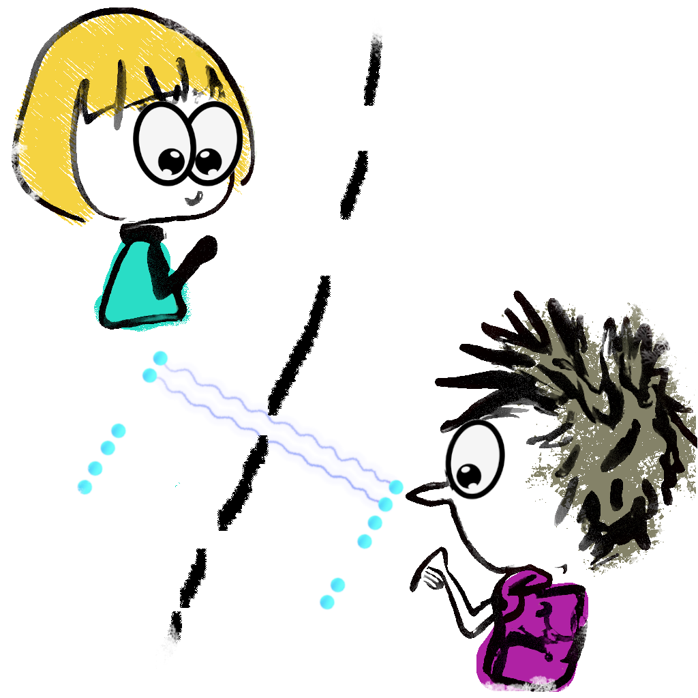
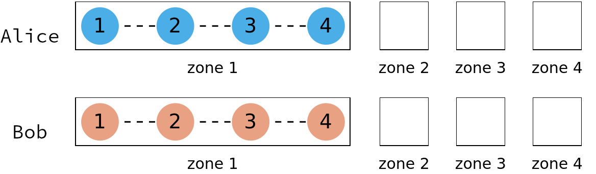

<div align="center">
 
</div>

# Trapped Ions

There is currently one virtual ion trap, which is multi-node ion traps. This device is based on a quantum device in the University of Oxford, which is instantiated with ``TrappedIonOxford[]``.

**Table of contents**
1. [Characteristics](#characteristics)
2. [Native operations](#native-operations)
3. [Parameters and usage](#parameters-and-usage)

## Characteristics

The multi-node ion traps have local full connectivity within each trap/node. In this virtual device, the user specifies the number of traps and the number of ions in each trap. Each trap contains four "zones", with each zone assigned to perform specific tasks. For instance, remote entanglement must be conducted in zone 4, gate operations in zones 2 and 3, and so on. Given these characteristics, the user needs to take into account the location of ions to perform operations.

We provide a command to check the position of ions. For instance, the following code instantiates a virtual ion trap and displays the position of ions. The user can freely specify the trap or node names, which are used in the operators. The following example shows two-node ion traps called **Alice** and **Bob**.

```Mathematica
dev = TrappedIonOxford[];
dev[ShowNodes]
```
 

The picture above shows the initial configuration of two ion traps, in which all ions in the trap are combined (shown by the dashed lines). Before performing a two-qubit gate, the corresponding ions must be **combined**.
## Native operations

The native operations of the virtual ion traps are the following. Note that, the user must specify the **node** name (**Alice** or **Bob** in the figure above) and the ion (indexed from **1** to **N**) in every operation. 

Every operator has designated zones; the user must shuttle the ions around to fulfil this requirement.

- Initialisation must be done to all ion
$$\mathtt{Init_{1,...,N}[node]}$$

- Qubit readout must be done to a single ion sitting alone in the zone.
$$\mathtt{Read_q[node]}$$

- Single-qubit gates are 
$$\mathtt{Rx_q[\theta]}, \mathtt{Ry_q[\theta]}, \mathtt{Rz_q[\theta]}$$

- Two-qubit gate is controlled-Z; qubits $\mathtt{q_1,q_2}$ must be **combined** before this gate.
$$\mathtt{CZ_{q_1,q_2}[node]}$$

- Remote gate between two different traps, generating entanglement gate. The following command initialises Bell pair $(\|01\rangle-\|10\rangle)/\sqrt{2}$ between qubit $\mathtt{q_1}$ in $\mathtt{node1}$ and $\mathtt{q_2}$ in $\mathtt{node2}$.
$$\mathtt{Ent_{q_1,q_2}[node1, node2]}$$

- Physical move: swap location between qubits $\mathtt{q_1}$ and $\mathtt{q_2}$; qubits $\mathtt{q_1,q_2}$ must be **combined** before this operator.
$$\mathtt{SWAPLoc_{q_1,q_2}[node]}$$

- Physical move: combine two qubits (physically means creating a sub-zone); both qubits must be sitting inside the same zone. This is required before applying any two-qubit operator, including physical swap.
$$\mathtt{Comb_{q_1,q_2}[node]}$$

- Physical move: split two combined qubits (physically means splitting the created sub-zone with Comb); both qubits must be sitting inside the same zone. This is required before moving the ion around.
$$\mathtt{Splz_{q_1,q_2}[node]}$$

- Physical move: shuttling the ions linearly to the destination zone **dzone**. All ions must be sitting inside the same zone. The move is linear, there is no ions in the path.
$$\mathtt{Shutl_{q_1,q_2,q_3,...}[node, dzone]}$$

- Doing nothing; remember it will introduce passive noise
$$\mathtt{Wait_q[\Delta t]}$$

### Zone and allowed operations

- **Zone 1**: $\mathtt{Shutl, Init, Read, Splz, Comb, SWAPLoc}$
- **Zone 2**: $\mathtt{Shutl, Init, Read, Splz, Comb, SWAPLoc, Rx, Ry, Rz, CZ}$
- **Zone 3**: $\mathtt{Shutl, Init, Read, Splz, Comb, SWAPLoc, Rx, Ry, Rz, CZ}$
- **Zone 4** : $\mathtt{Shutl, Ent}$


## Parameters and usage

The following configuration takes inspiration from a device at the University of Oxford. The code provided below can be directly copied and executed.

- Time unit is **microseconds** ($\mu s$)
- Frequency unit is **Megahertz** (MHz)

```Mathematica
Options[TrappedIonOxford] = {
   (* the name of trap nodes name together and the number of ions on each node *)
   Nodes -> <|"Alice" -> 4, "Bob" -> 4|>
   ,
   (* the T1 time, exponential decay *)
   T1 -> <|"Alice" -> 3*10^9, "Bob" -> 3*10^9    |>
   ,
   (* the T2* time, Gaussian decay *)
   T2s -> <|"Alice" -> 10^5,  "Bob" -> 10^5   |>
   ,
   (* Duration for moving operations: Split, Combine, and physical SWAP *)
   DurMove -> <| "Alice" -> <|Shutl -> 25, Splz -> 50, Comb -> 50, SWAPLoc -> 10 |>, "Bob" -> <|Shutl -> 25, Splz -> 50, Comb -> 50, SWAPLoc -> 10 |> |>
   ,
   (* fidelity and duration of initialisation on each qubit; the initialisation is done simultaneously on all ions *)
   FidInit -> <|"Alice" -> 0.9999, "Bob" -> 0.9998|>
   ,
   DurInit -> <|"Alice" -> 20, "Bob" -> 20|>
   ,
   (* readout duration *)
   DurRead -> <|"Alice" -> 50, "Bob" -> 50|>
   ,
   (* Symmetric bit-flip error during readout  *)
   ProbBFRead -> <|"Alice" -> 10^-3, "Bob" -> 10^-3|>
   ,
   (*Fidelity of single x- and y- rotations; z-rotation is instaneous (noiseless, virtual)*)
   FidSingleXY -> <|"Alice" -> 0.99999, "Bob" -> 0.99999|>
   ,
   (*fraction of depolarising:dephasing noise of the x- and y-rotations *)
   EFSingleXY -> <|"Alice" -> {1, 0}, "Bob" -> {1, 0}|>
   ,
   (* Rabi frequency on single rotations *)
   RabiFreq -> <|"Alice" -> 10, "Bob" -> 10 |>
   ,
   (* Frequency of CZ operation *)
   FreqCZ -> <|"Alice" -> 0.1, "Bob" -> 0.1|>
   ,
   (* Fidelity of CZ operation *)
   FidCZ -> <|"Alice" -> 0.999, "Bob" -> 0.999|>
   ,
   (* fraction of two-qubit depolarising: dephasing error after entanglement distillation *)
   EFCZ -> <|"Alice" -> {0.1, 0.9}, "Bob" -> {0.1, 0.9}|>
   ,
   (* rate of heralded remote entanglement generation *)
   FreqEnt -> 0.1
   ,
   (* fidelity of the raw bell pair *)
   FidEnt -> 0.95
   ,
   (* fraction of noise on the obtained raw bell pair, 2-qubit depolarising:dephasing *)
   EFEnt -> {0.1, 0.9}
   ,
   (* Switch on/off the standard passive noise: decays T1 and T2*  *)
   StdPassiveNoise -> True
   };
```
In practice, gates parallelisation on ion traps is applicable to certain operations with
some configuration of zones, e.g., when qubits are in different zones concurrent 
gates may be acted upon them. However, as this effort is still actively explored,
we do not implement parallelisation on this virtual ion traps for practical reasons.
However, the user must rearrange the gates as there are multiple nodes involved,
in which parallelisation is applicable on different nodes. This arrangement is 
taken care by function ``CircTrappedIons[]``, with option ``MapQubits -> True``
or ``MapQubits -> False``.

The simulation of the multi-node ion trap is performed on the total density matrix.
Therefore, we partition the density matrix into the corresponding nodes. 
The option ``MapQubits -> True`` will map the local indices within a node into
the global indices for the whole density matrix. This is useful to check the circuit
arrangement globally, for instance command
```Mathematica 
DrawCircuit @ CircTrappedIons[circuit, TrappedIonOxford[], MapQubits -> True]
```
will draw the (noiseless) circuits arranged according to multi-nodes indices. 
However, to obtain the noise-decorated ``circuit`` to simulate on the noisy
ion traps, one must set ``MapQubits -> False``. See example below.
```Mathematica
mytraps = TrappedIonOxford[]; 
noisycircscheduled = InsertCircuitNoise[CircTrappedIons[circuit, mytraps, MapQubits -> False], mytraps, ReplaceAliases -> True];
noisycirc = Extractcircuit @ noisycircscheduled;
ApplyCircuit[rho, noisycirc]
```
First, variable ``noisycircscheduled`` contains noise-decorated ``circuit`` together with its schedule.
Command ``CircTrappedIons[circuit, mytraps, MapQubits -> False]`` imposes serial implementation
locally to the node, but parrallel with respect to different nodes.
Note that, option ``ReplaceAliases`` replaces gate aliases/custom gates into standard **QuESTlink** operations:
for instance ``Init`` gate here is defined as amplitude damping.
Variable ``noisycirc`` contains noise-decorated ``circuit`` that is ready for simulation. 
Second, the command ``ExtractCircuit[]`` basically removes the schedule information.
Finally, command ``ApplyCircuit`` operates ``noisycirc`` upon the density matrix ``rho``. 
 


